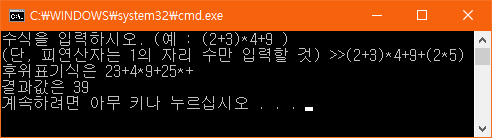

# InfixToPrefixCalculator
* 중위표기식을 후위표기식으로 연산하는 프로그램

## 개요
* 중위표기식을 입력하여 후위표기식으로 변환하고 계산하여 결과를 보여줍니다.

## 개발 목적
* 우송대학교 자료구조 개인과제 - 스택을 응용한 과제

## 개발 기간
* 2016.10.31 ~ 2016.11.06

## 기술 스택
* C++

## 개발 환경
* OS : Windows 8.1
* IDE : Visul Studio 2015

## 실행 화면
